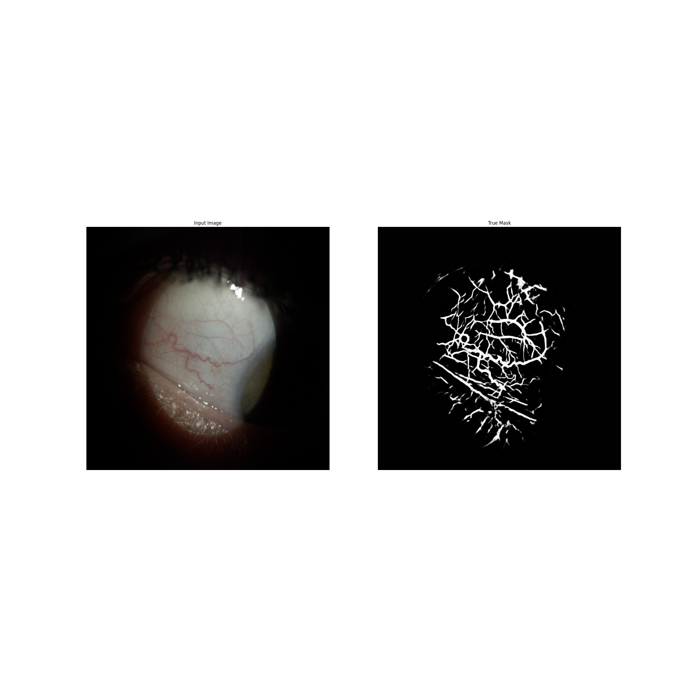
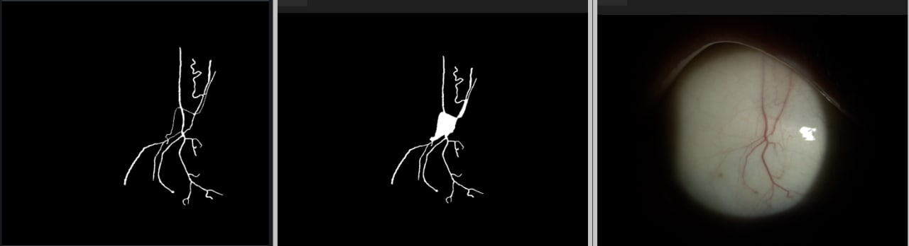
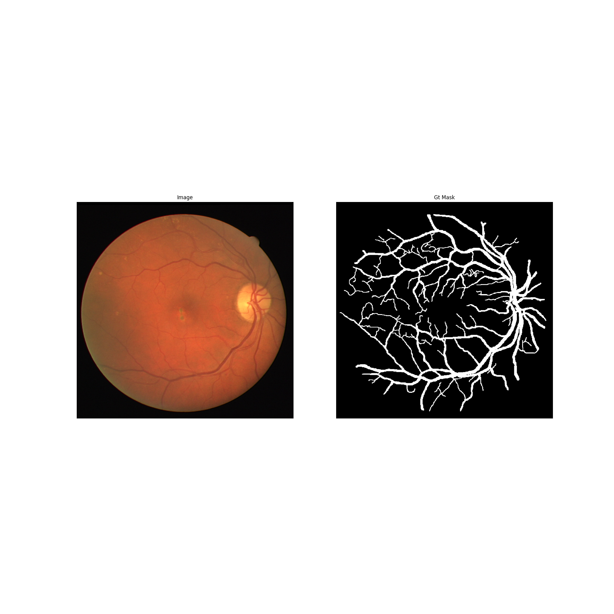
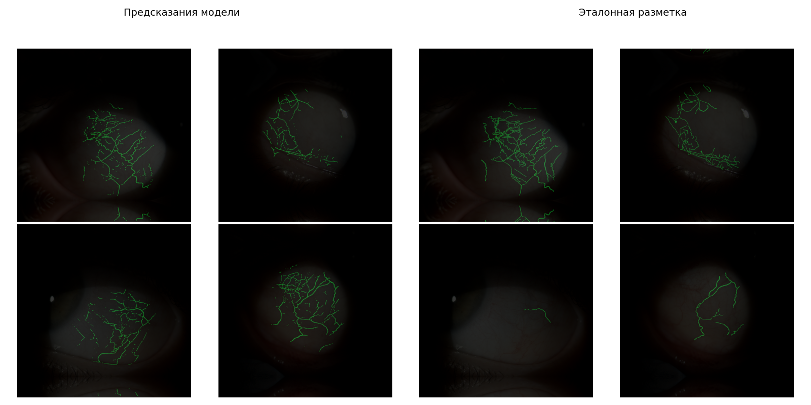

# Eye Vessel Segmentation

> Semantic segmentation of human eye capillaries from ophthalmic slit-lamp photographs.

Deep-learning solution built for the **"Digital Breakthrough. Season: AI"** national championship

---

## The problem

Ophthalmology generates a large volume of imagery, yet very little of the routine analysis is
automated. The organizers assembled a unique dataset of **~1000 slit-lamp eye photographs**, each
accompanied by a hand-drawn vessel annotation in **GeoJSON** format (created in QuPath). The task is
to train a model that reproduces those vessel masks on unseen images.

Scoring uses the **F-measure** between the predicted and the reference masks:

```
accuracy(A, B) = |A ∩ B| / |A|      (precision)
recall(A, B)   = |A ∩ B| / |B|
F(A, B)        = 2 · accuracy · recall / (accuracy + recall)
```

where `A` is the ground-truth mask and `B` is the prediction.

### Sample: input photo and its vessel mask



---

## Approach

### 1. From GeoJSON annotations to binary masks

The raw labels are polygons stored in GeoJSON. [`mask.py`](mask.py) and [`mask_util.py`](mask_util.py)
rasterize those polygons into binary masks, correctly handling `MultiPolygon` geometries and
inner/outer rings (holes are punched out, vessels are filled).



### 2. Segmentation models

Several architectures were trained and compared:

| Script | Framework | Architecture | Notes |
| --- | --- | --- | --- |
| [`test.py`](test.py) | PyTorch | U-Net + ResNet-50 | Full training loop, metrics, inference |
| [`train_1536_2.py`](train_1536_2.py) | TensorFlow / Keras | U-Net + EfficientNet-B0 | High-resolution 1536×1536 input |
| [`train_augmentation.py`](train_augmentation.py) | TensorFlow / Keras | U-Net | Heavy data augmentation experiment |
| [`train_dice.py`](train_dice.py) | TensorFlow / Keras | U-Net | Pure Dice-loss variant |
| [`train_swin.py`](train_swin.py) | TensorFlow / Keras | Swin-UNet / TransUNet | Transformer-based segmentation experiment |

**Loss functions.** Vessels cover only a tiny fraction of each image, so the segmentation is
strongly class-imbalanced. The models use **Dice loss** and a combined **BCE + Dice** loss, with a
**soft-Dice (F1)** metric tracked alongside accuracy and recall to match the competition metric.

**Resolution handling.** Photos are cropped and symmetrically zero-padded to a square 1536×1536
canvas for training, then the predicted masks are mapped back to the original frame geometry.

### 3. Transfer learning from public retinal datasets

To compensate for the limited training set, the encoders were pretrained on well-known public
retinal-vessel datasets — **DRIVE**, **CHASE_DB1**, **STARE** and **HRF** — before fine-tuning on
the slit-lamp data.



### 4. Post-processing

Raw network output is cleaned up with classical computer-vision heuristics in
[`prepare_color.py`](prepare_color.py), [`prepare_color_add.py`](prepare_color_add.py) and
[`square.py`](square.py):

- small spurious contours are removed by **area** threshold;
- contours whose **mean colour** deviates too far from the typical vessel colour are dropped;
- tiny internal holes inside detected vessels are filled back in.

This contour filtering measurably improved the final F-score over the bare network prediction.

### Results: predictions vs. ground truth



---

## Repository layout

```
.
├── test.py                 # PyTorch U-Net (ResNet-50) — training + inference
├── train_1536_2.py         # Keras U-Net (EfficientNet-B0), 1536×1536
├── train_augmentation.py   # Augmentation experiment
├── train_dice.py           # Dice-loss experiment
├── train_swin.py           # Swin-UNet / TransUNet experiment
├── mask.py / mask_util.py  # GeoJSON → binary mask conversion
├── prepare_color.py        # Contour post-processing (area + colour filtering)
├── prepare_color_add.py    # Additional post-processing pass
├── prepare.py              # Data preparation helpers
├── square.py               # Geometry / contour utilities
├── baseline.ipynb          # Baseline exploration notebook
├── eye.ipynb               # Experiments notebook
└── images/                 # Figures used in this README
```

> Large artifacts — the dataset, archived results and trained model weights (`*.zip`, `*.pth`,
> `*.ckpt`) — are intentionally excluded from version control (see [`.gitignore`](.gitignore)).

---

## Running

```bash
pip install torch segmentation-models-pytorch albumentations \
            tensorflow keras segmentation-models keras-unet-collection \
            opencv-python pillow numpy scikit-learn tqdm matplotlib

# 1. Build masks from GeoJSON annotations
python mask.py

# 2. Train a model (PyTorch U-Net example)
python test.py

# 3. Post-process the raw predictions
python prepare_color.py
```

The training scripts expect the dataset laid out as `train/` (images + `.geojson`), generated
masks in `masks-2-pure/`, and images to predict in `check/`; predictions are written to `result/`.

---

## Tech stack

PyTorch · TensorFlow / Keras · `segmentation_models_pytorch` · `segmentation_models` ·
`keras-unet-collection` · Albumentations · OpenCV · NumPy · scikit-learn

## License

Released under the [GNU GPL v3](LICENSE).
